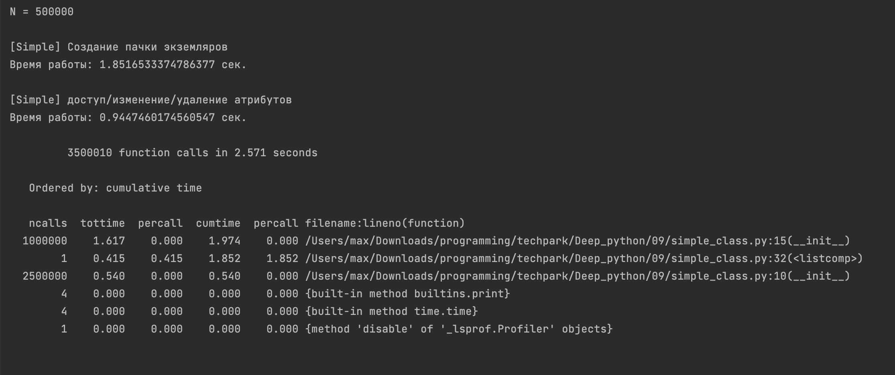
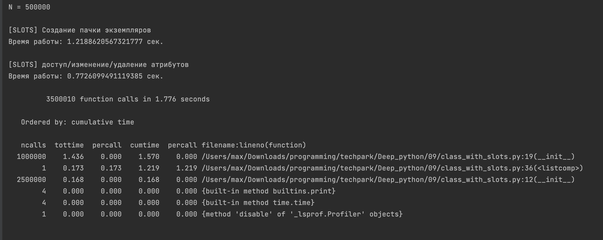
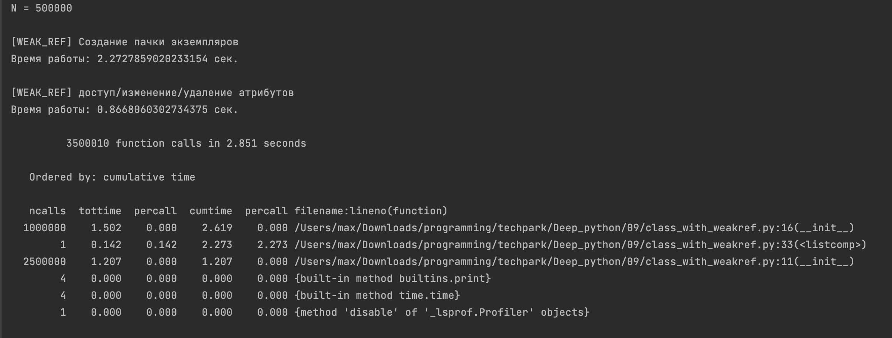

___Работа программы обычного класса___

___Работа программы класса со слотами___

___Работа программы класса с weakref___

_____ВЫВОД:_____  
Как можно увидеть, класс, использующий слоты, работает быстрее всех.
